# Metropolia Databases 1 (by Artur Roos)

## Week 1 

### Exercises 1

## Week 2

## Week 3

### Exercises 2

1.  `select * from goal`

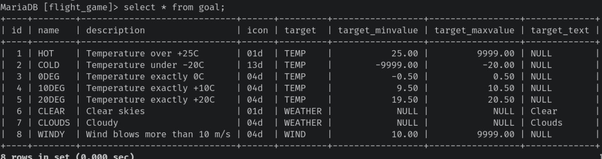

2.  `select name,type from airport where iso_country = "FI"`

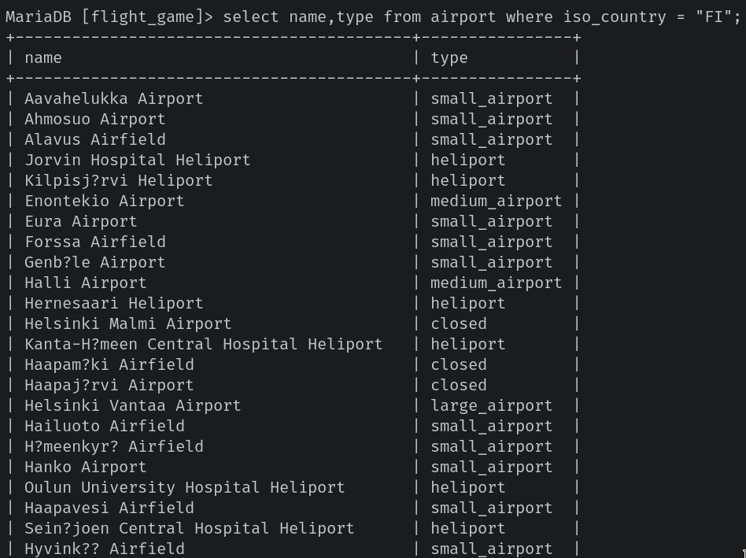

3.  `select name from airport where iso_country = "FI" order by name`

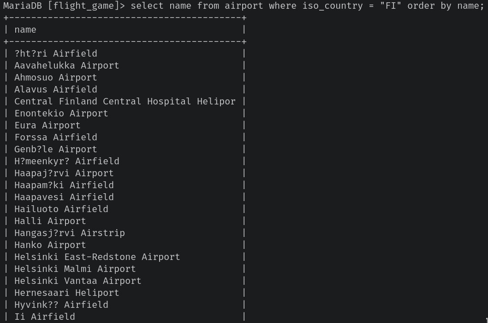

4.  `select name,type from airport where iso_country = "FI" order by type,name`

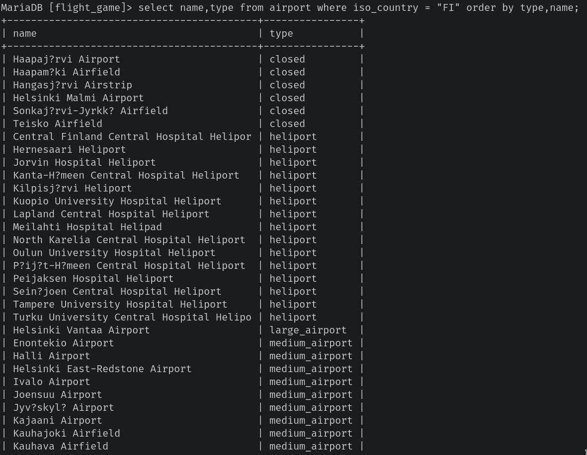

5.  `select name from country where name like "F%"`

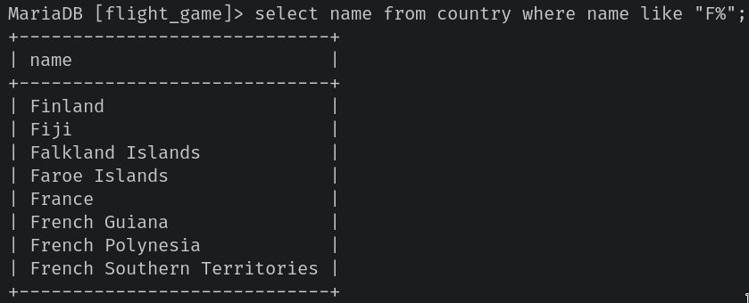

6.  `select name from country where name like "%f%"`

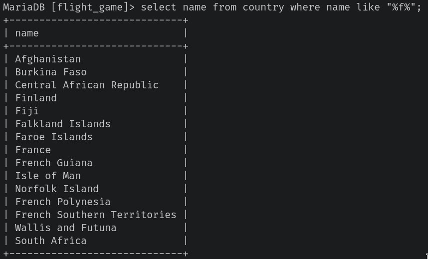

7.  `select location from game where screen_name = "Vesa"`

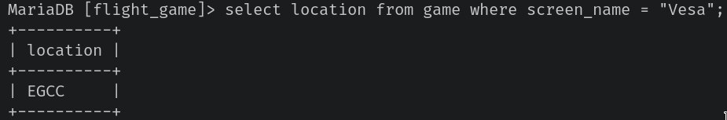

8.  `select co2_consumed from game where screen_name = "Ilkka"`

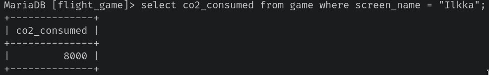

9.  `select co2_budget from game limit 1`

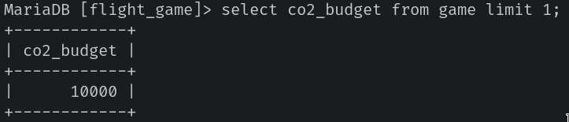

10. `select screen_name,co2_budget,co2_consumed,(co2_budget - co2_consumed) as co2_left from game where screen_name = "Ilkka"`

### Exercises 3

1. `select country.name as "country name", airport.name as "airport name" from airport inner join country on airport.iso_country = country.iso_country where country.name = 'Iceland' order by airport.name`

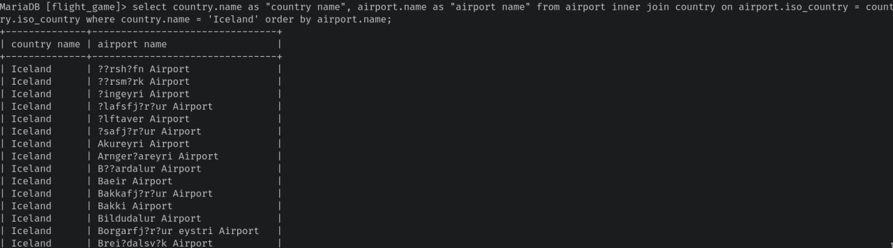

2. `select airport.name from airport
    inner join country on airport.iso_country = country.iso_country
                    where country.name = "France" and airport.type = "large_airport"`

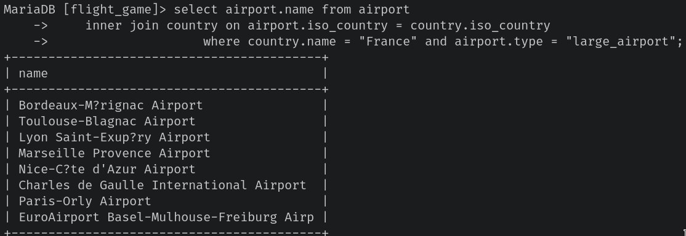

3. `select ("Antarctica") as "country_name",name as "airport_name" from airport where continent = "an" order by name`

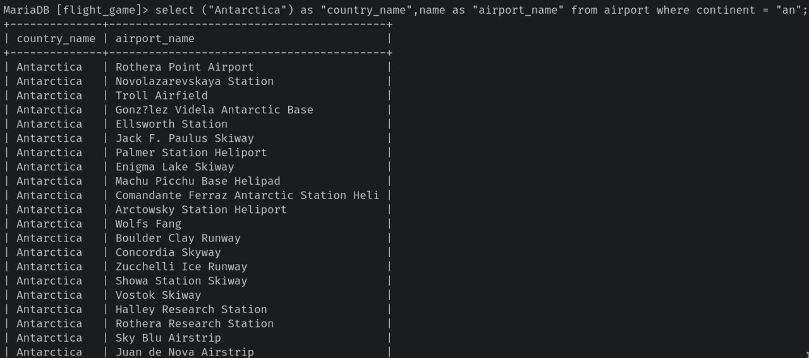

4. `select elevation_ft from game inner join airport on game.location = airport.ident where game.screen_name = "Heini"`

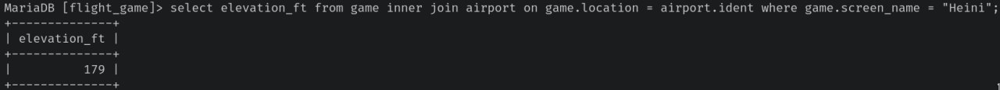

5. `select (elevation_ft * 0.3048) as "elevation_m" from game inner join airport on game.location = airport.ident where game.screen_name = "Heini"`

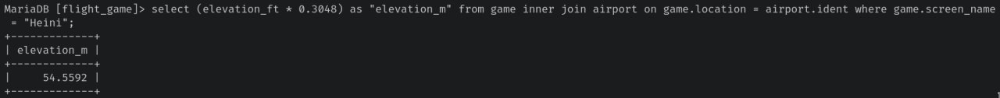

6. `select airport.name from airport inner join game on game.location = airport.ident where game.screen_name = "Ilkka"`

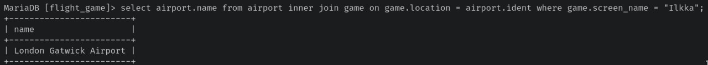

7. `select country.name from airport inner join game on game.location = airport.ident inner join country on airport.iso_country = country.iso_country where game.screen_name = "Ilkka"`

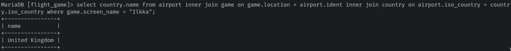

8. `select name from goal_reached inner join game on game.id = goal_reached.game_id inner join goal on goal.id = goal_reached.goal_id where game.screen_name = "Heini"`

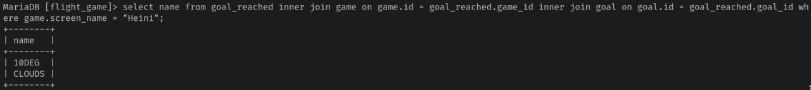

9. `select airport.name from airport
    inner join goal_reached
    inner join game on game.id = goal_reached.game_id
    inner join goal on goal.id = goal_reached.goal_id
                    where game.screen_name = "Ilkka" and goal.name = "CLOUDS" and airport.ident = game.location`

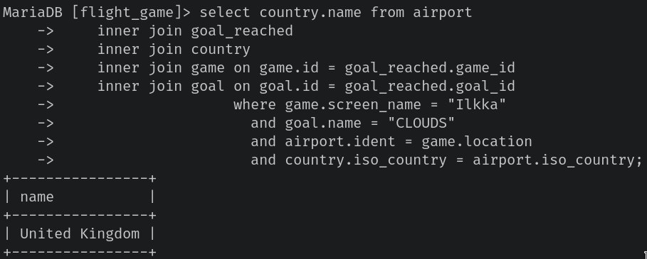

10. `select country.name from airport
    inner join goal_reached
    inner join country
    inner join game on game.id = goal_reached.game_id
    inner join goal on goal.id = goal_reached.goal_id
                    where game.screen_name = "Ilkka"
                      and goal.name = "CLOUDS"
                      and airport.ident = game.location
                      and country.iso_country = airport.iso_country`

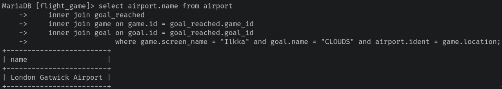

## Week 4

### Exercises 4

1. `select country.name as "country name", airport.name as "airport name" from airport inner join country on airport.iso_country = country.iso_country where country.name = "Finland"`

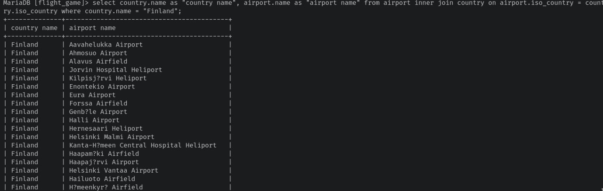

2. `select game.screen_name,airport.name from game inner join airport on game.location = airport.ident`

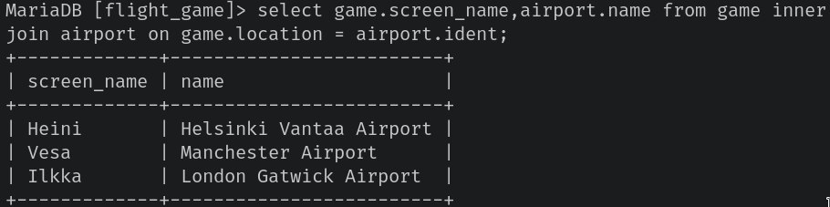

3. `select game.screen_name,country.name from game
    inner join airport on game.location = airport.ident
    inner join country on airport.iso_country = country.iso_country;`

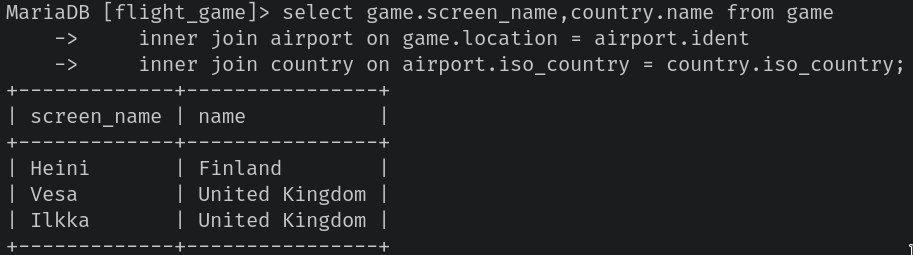

4. `select airport.name,game.screen_name from airport left join game on airport.ident = game.location where airport.name like "%Hels%"`

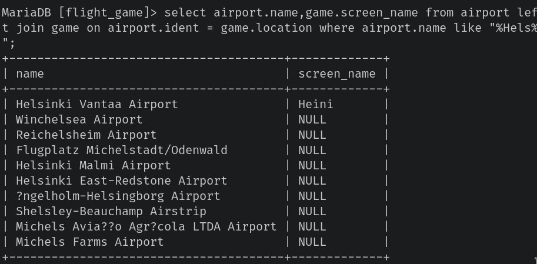

5. `select goal.name,game.screen_name from goal
    left join goal_reached on goal_reached.goal_id = goal.id
    left join game on game.id = goal_reached.game_id`

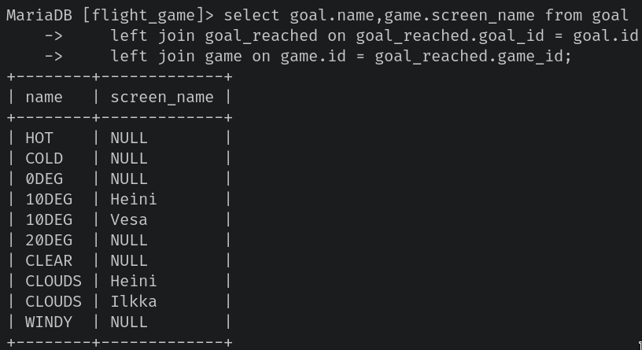

### Exercises 5

1. `select country.name from country where country.iso_country = (select
    airport.iso_country from airport where airport.name like "Satsuma %")`

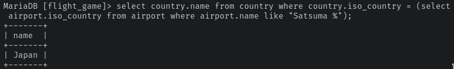

2. `select airport.name from airport where airport.iso_country = (select country.iso_country from country where country.name = "Monaco")`

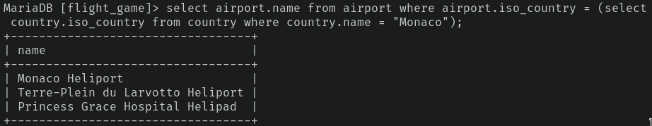

3. `select game.screen_name from game inner join goal_reached on goal_reached.game_id = game.id where goal_reached.goal_id = (select goal.id from goal where goal.name = "CLOUDS");`

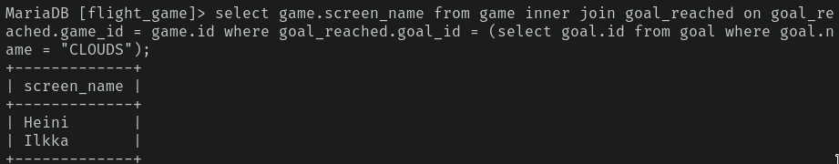

4. `select country.name from country where country.iso_country not in (select airport.iso_country from airport)`

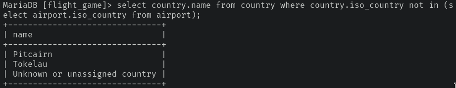

5. `select goal.name from goal where goal.id not in (select goal.id from goal inner join goal_reached on goal.id = goal_reached.goal_id inner join game on goal_reached.game_id = game.id where game.screen_name = "Heini")`

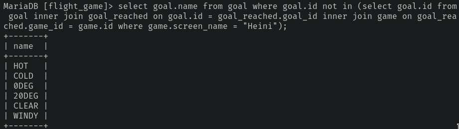

## Week 5

### Exercises 6

1. `select max(elevation_ft) from airport`

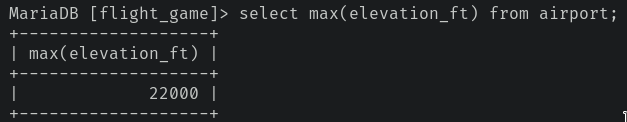

2. `select continent,count(*) from airport group by continent`

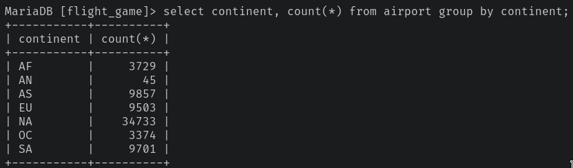

3. `select game.screen_name,count(*) from goal_reached inner join game on goal_reached.game_id = game.id group by game.screen_name`

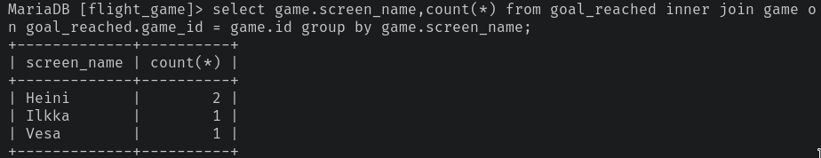

4. `select game.screen_name from game where game.co2_consumed = (select min(co2_consumed) from game)`

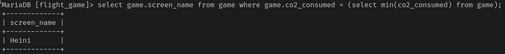

5. `select country.name,count(*) from airport inner join country on airport.iso_country = country.iso_country group by country.iso_country order by count(*) desc`

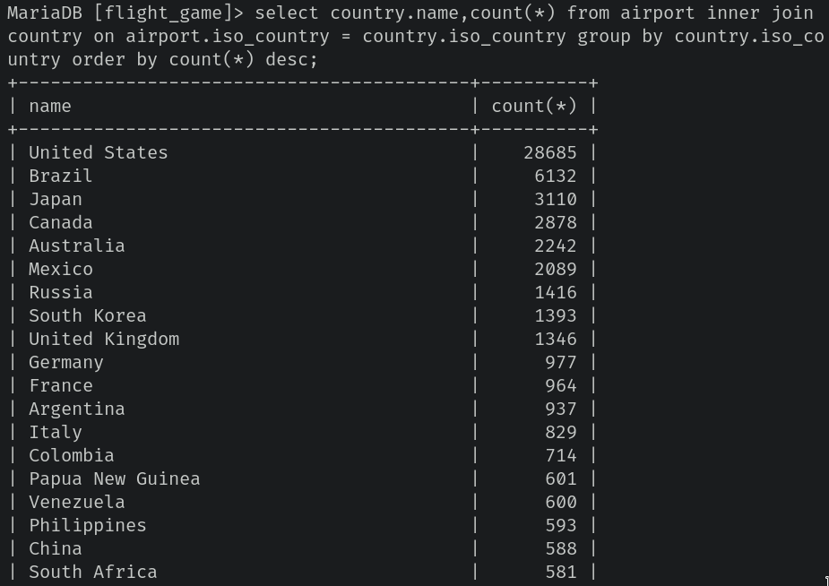

6. `select country.name,count(*) from airport inner join country on airport.iso_country = country.iso_country group by airport.iso_country having count(*) > 1000`

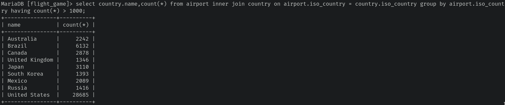

7. `select name from airport where elevation_ft = (select max(elevation_ft) from airport)`

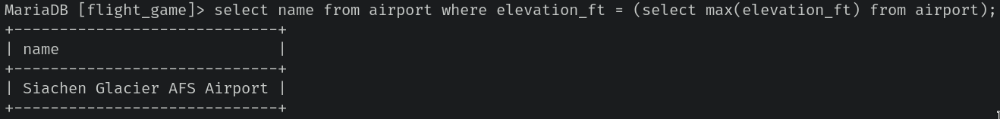

8. `select name from country where iso_country = (select iso_country from airport where elevation_ft = (select max(elevation_ft) from airport))`

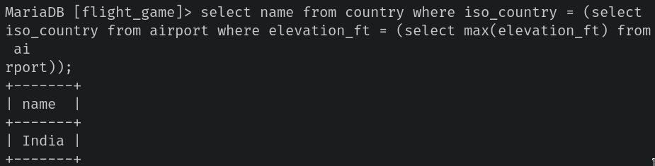

9. `select count(*) from goal_reached where game_id = (select id from game where screen_name = "Vesa")`

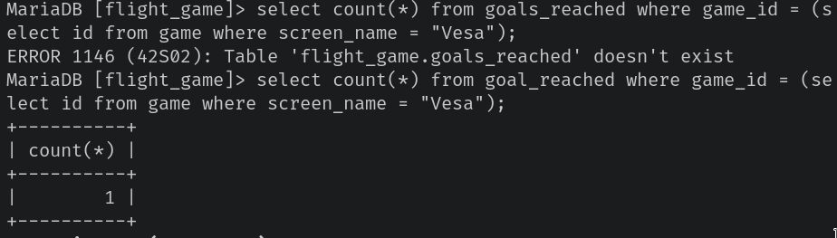

10. `select name from airport where latitude_deg = (select min(latitude_deg) from airport)`

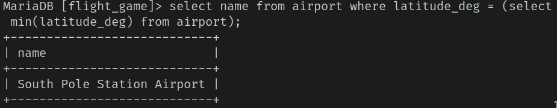
